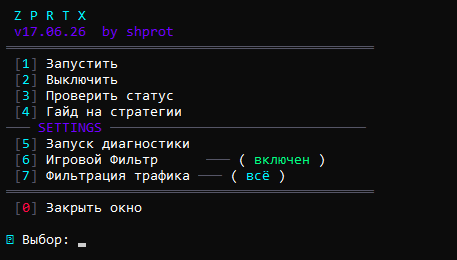

<div align="center">
<pre>
 ───═▶   ███████╗██████╗ ██████╗ ████████╗██╗  ██╗   ◀═───
 ───═▶   ╚══███╔╝██╔══██╗██╔══██╗╚══██╔══╝╚██╗██╔╝   ◀═───
 ───═▶     ███╔╝ ██████╔╝██████╔╝   ██║    ╚███╔╝    ◀═───
 ───═▶    ███╔╝  ██╔═══╝ ██╔══██╗   ██║    ██╔██╗    ◀═───
 ───═▶   ███████╗██║     ██║  ██║   ██║   ██╔╝ ██╗   ◀═───
 ───═▶   ╚══════╝╚═╝     ╚═╝  ╚═╝   ╚═╝   ╚═╝  ╚═╝   ◀═───
</pre>
</div>


---

☑️ Сборка, объединившая в себе версию от **Lux1de** и версию от **Flowseal**.

---
<div align="center">
  
</div>


### 🛠️ Интерфейс и управление

| Кнопка | Функция | Описание |
| :---: | :--- | :--- |
| **`[1]`** | **Запустить** | Регистрирует и запускает автоматическую службу Windows. Обход будет работать сам в фоне. |
| **`[2]`** | **Выключить** | Полностью останавливает процессы, удаляет фоновые службы и выгружает драйвер WinDivert. |
| **`[3]`** | **Проверить статус** | Мгновенно выводит текущее состояние фоновых служб утилиты. |
| **`[4]`** | **Гайд на стратегии** | Открывает справочную информацию по технологиям обхода и режимам работы утилиты. |
| **`[5]`** | **Запуск диагностики** | Сканирует систему на конфликтующие программы и предлагает очистить кэш Discord 🗑️. |
| **`[6]`** | **Игровой Фильтр** | Переключает диапазон обрабатываемых портов: <br>• `выключен` - обрабатывается только порт 12 (игры не затрагиваются). <br>• `включен` — активируется обход портов `1024-65535`<br>*После изменения требуется перезапустить службу (кнопки 2, затем 1).* |
| **`[7]`** | **Фильтрация трафика** | Циклически меняет режим работы со списком адресов: <br>• 🟢 `ограничено` — обход работает только по базе заблокированных IP (`ipset-all.txt`). <br>• 🔘 `выключен` — фильтрация заглушается фейковым адресом (работа по списку отключена). <br>• 🔵 `всё` — файл списка очищается, утилита пускает абсолютно весь трафик через обход. <br>*После изменения требуется перезапустить службу (кнопки 2, затем 1).* |
| **`[0]`** | **Закрыть окно** | Безопасно завершает работу консольного меню, оставляя службы работать в фоне. |

---

### 🚀 Инструкция по запуску

Для корректной работы утилиты строго следуйте пошаговой инструкции:

1. **Распаковка архива**: Скачайте актуальный релиз и обязательно распакуйте архив в отдельную папку. 
   *⚠️ Не запускайте файлы прямо из архива WinRAR/7-Zip - софт не сможет создать нужные службы.*
2. **Основной лаунчер**: Найдите в корневой директории файл **`MAIN.bat`**. 
3. **Запуск от Администратора**: Утилита сама должна запуститься от имени Администратора, если этого не произошло по какой либо причине, нажмите на `MAIN.bat` правой кнопкой мыши и выберите **«Запуск от имени администратора»**. Это критически важно, так как обычный пользователь не имеет прав устанавливать системные службы Windows и управлять драйвером WinDivert.
4. **Включение обхода**: используйте инструкцию по управлению выше

---
### 📖 Гайд на стратегии
```text
 ══════════════════════════════════════════════

  Этот инструмент не является классическим VPN.
  Он не меняет ваш IP-адрес и не пускает трафик через чужие серверы.
  Вместо этого он прямо на вашем компьютере «пудрит мозги» системам
  блокировок вашего интернет-провайдера, изменяя структуру сетевых пакетов.

 ════════════════════ ТЕРМИНЫ ════════════════════

  SIMPLE  │  Программа режет ваш запрос на мелкие кусочки
          │  (фрагментирует) или слегка меняет регистр букв
          │  (вместо youtube.com пишет YoUtUbE.cOm)

  FAKE    │  Программа создаёт ложный, «мусорный» пакет и кидает
          │  его провайдеру. Система блокировки отвлекается на этот
          │  мусор, а в этот момент за ним пролетает ваш запрос.

  TLS     │  Протокол защиты сайтов. Пакет замаскирован под начало
          │  безопасного соединения с сайтом. Это бьёт точно в цель
          │  при разблокировке сайтов в браузере.

  AUTO    │  Автоматический расчет дистанции. Программа сама вычисляет,
          │  как далеко от вас находится блокиратор провайдера, чтобы
          │  фейковый пакет исчез ровно на его оборудовании.

  ALT     │  Разные варианты цифровых настроек.
          │  (ALT / ALT2 / ALT3) — готовые наборы параметров для перебора.

 ══════════════════ СТРАТЕГИИ ══════════════════

  [1] general (SIMPLE FAKE)
      Двойной удар. Программа сначала нарезает ваш реальный запрос
      на части, а перед ними отправляет фейковый пакет для отвлечения
      внимания. Сбалансированный вариант — часто оживляет YouTube
      на большинстве региональных провайдеров.

  [2] general (FAKE TLS AUTO)
      Создает очень правдоподобный поддельный пакет шифрования (TLS)
      и автоматически настраивает его дальность (AUTO),
      чтобы обмануть ТСПУ.

 ══════════════════════════════════════════════
```

### 🔗 Ищете больше возможностей? Встречайте Proximity!

📦 **[Перейти в репозиторий Proximity](https://github.com/shprttx/Proximity)**

**Proximity** - это полноценный многофункциональный комбайн, объединенный в одно удобное Windows-приложение. Больше никаких разрозненных папок и кучи скриптов - все инструменты собраны в одной единой экосистеме, работают из коробки и управляются через общий интерфейс. 

Помимо встроенной утилиты **ZpRtX**, приложение включает в себя:
* 🌐 **Happ VPN** (от *Flyfrog LLC*) - продвинутый инструмент маршрутизации и конфигураций для управления трафиком.
* 🧡 **Cloudflare WARP** (от *Cloudflare, Inc.*) - Утилита, объединяющая функции VPN и безопасного DNS-резолвера. Ускоряет загрузку сайтов и открывает доступ к зарубежным ИИ-моделям (Gemini, Claude, ChatGPT).
* ✈️ **TG Proxy** (от *Flowseal*) - локальный MTProto-прокси для Telegram Desktop, который ускоряет работу Telegram, перенаправляя трафик через WebSocket-соединения. Данные передаются в том же зашифрованном виде, а для работы не нужны сторонние серверы.
* 🎮 **zprtx** (от *Shprot*) - обход ограничений для YouTube, Roblox и Discord, который уже настроен и интегрирован внутрь приложения.

---

### ⚖️ Лицензирование

Проект распространяется на условиях лицензии [MIT](https://github.com/shprttx/zprtx/blob/main/LICENSE)
